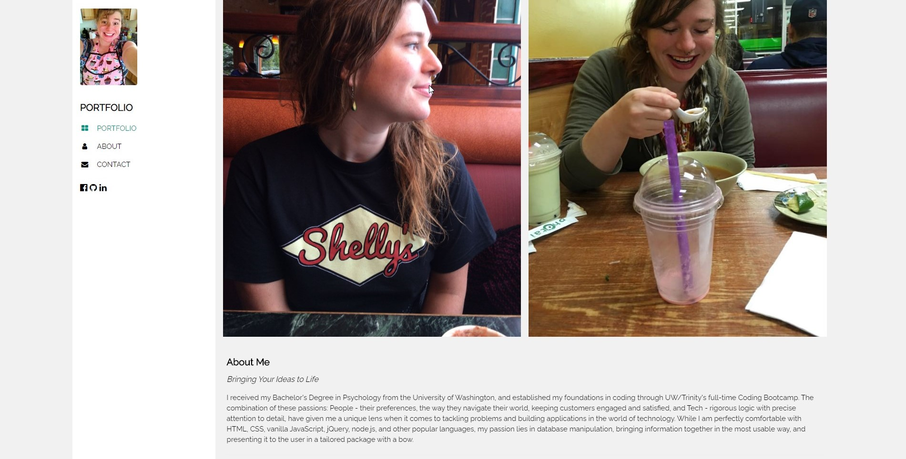

# revised-portfolio#

## Description 

Our third revision of our portfolio page. In this version I went with a new layout removed any forms that were not interactive, added links to my newest projects, made sure that all of my social media links were functional, and added a downloadable version of my resume.

github link to project: https://github.com/arielbs1991/revised-portfolio

deployed link to project: https://arielbs1991.github.io/revised-portfolio/

## Credits

I used an html template from http://w3schools.com as my basis for this site.

